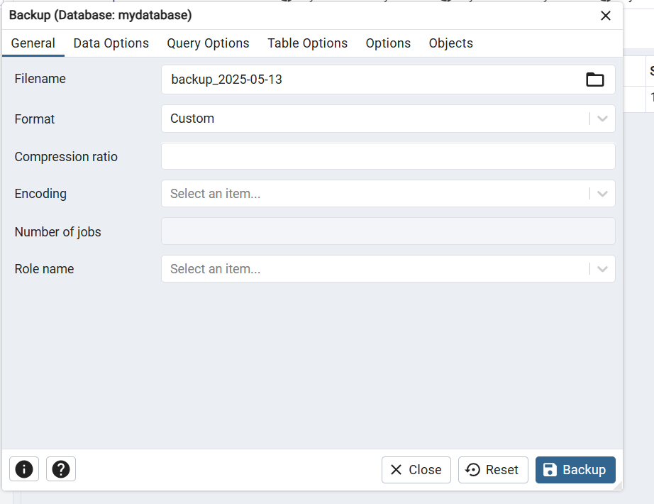

# DBProject - Restaurant Management System

## Title Page: Team Members, System Name, and Chosen Unit:

* Project: Restaurant Management System
* Unit: Front-End and Data Systems

---

## Table of Contents:

1. Introduction
2. ERD + DSD
3. Data Insertion Methods (3 Approaches)
4. Backup and Restore

---

## Introduction:

The "Restaurant Management System" is designed to manage the core operations of a restaurant: handling customers, orders, employees, dishes, and dining tables. The database enables storing detailed information on all these components and allows efficient data manipulation and querying through relationships.

---

## ERD + DSD:

* \[✓] ERD: Entity Relationship Diagram created using ERDPlus
* \[✓] DSD: Data Structure Diagram with table schemas, types, primary and foreign keys

**Key Design Decisions:**

* Inclusion of two significant `DATE` fields: `join_date`, `hire_date`, `last_cleaned`, `order_date`
* `Order_Details` acts as a junction table between Orders and Dishes (many-to-many)
* Each entity contains at least 3 meaningful attributes (many have more)
* Full normalization applied up to 3NF

---

## Data Insertion - 3 Methods:

### 1. Mockaroo

* Random data generated using \[mockaroo.com]
* Output in SQL format for `Customer` and other tables
* Folder: `mockarooFiles/`
* 

### 2. Python Script

* Script generates random data for all 6 tables
* Output is SQL-compatible inserts
* Folder: `Programing/`
* 

### 3. Manual Text File

* Basic SQL insert script created manually
* At least 3 rows per table
* Folder: `dataImportFiles/`
* 

---

## Backup and Restore:

* Full database backup performed via pgAdmin
* File name: `backup_2025-05-13.sql`
* Location: `/var/lib/pgadmin/storage/admin_example.com/`
* Contents:

  * All table definitions
  * Complete dataset
  * Foreign key and primary key constraints

### The backup was restored on a separate machine and tested successfully 

* 
)

---

> All required files are uploaded to GitHub under the structure specified in the project instructions, including: `createTables.sql`, `dropTables.sql`, `insertTables.sql`, `selectAll.sql`, and the backup SQL.
