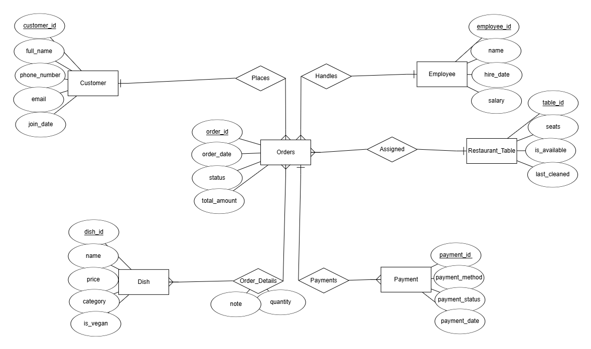
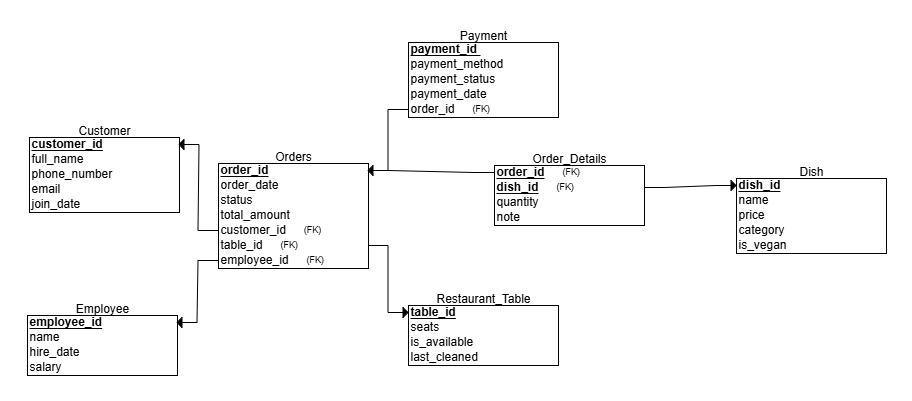

# DBProject - Restaurant Management System

## Title Page: Team Members, System Name, and Chosen Unit:

* Project: Restaurant Management System
* Unit: Front-End and Data Systems

---

## Table of Contents:

1. Introduction
2. ERD + DSD
3. Data Insertion Methods (3 Approaches)
4. Backup and Restore

---

## Introduction:

The Restaurant Management System project is a database-driven solution aimed at organizing and tracking all the operational aspects of a restaurant. The system includes the following main entities:

Customer: Holds details such as full name, phone number, email, and join date.

Dish: Stores information about each dish including name, price, category (e.g., appetizer, main course), and whether it's vegan.

Employee: Contains employee records including name, hire date, and salary.

Restaurant Table: Represents physical tables in the restaurant with seat count, availability status, and last cleaned date.

Orders: Tracks individual orders placed by customers, including date, status (e.g., completed, cancelled), assigned employee, and the table.

Order Details: A junction table connecting orders to dishes, indicating quantity and special notes for each dish in an order.

The system is designed to support efficient restaurant operations: managing customer service, seating arrangements, employee assignments, and real-time tracking of orders and dish preparation. With clear relationships between entities, the system ensures data consistency and supports queries for operational analysis and management decisions.

The "Restaurant Management System" is designed to manage the core operations of a restaurant: handling customers, orders, employees, dishes, and dining tables. The database enables storing detailed information on all these components and allows efficient data manipulation and querying through relationships.

---

## ERD + DSD:

* \[✓] ERD: Entity Relationship Diagram created using ERDPlus
* \[✓] DSD: Data Structure Diagram with table schemas, types, primary and foreign keys
* 
* 

**Key Design Decisions:**

* Inclusion of two significant `DATE` fields: `join_date`, `hire_date`, `last_cleaned`, `order_date`
* `Order_Details` acts as a junction table between Orders and Dishes (many-to-many)
* Each entity contains at least 3 meaningful attributes (many have more)
* Full normalization applied up to 3NF

---

## Data Insertion - 3 Methods:

### 1. Mockaroo

* Random data generated using \[mockaroo.com]
* Output in SQL format for `Customer` and other tables
* Folder: `mockarooFiles/`
* 

### 2. Python Script

* Script generates random data for all 6 tables
* Output is SQL-compatible inserts
* Folder: `Programing/`
* 

### 3. Manual Text File

* Basic SQL insert script created manually
* At least 3 rows per table
* Folder: `dataImportFiles/`
* 

---

## Backup and Restore:

* Full database backup performed via pgAdmin
* File name: `backup_2025-05-13.sql`
* Location: `/var/lib/pgadmin/storage/admin_example.com/`
* Contents:

  * All table definitions
  * Complete dataset
  * Foreign key and primary key constraints
* 
### The backup was restored on a separate machine and tested successfully 

* 
)

---

> All required files are uploaded to GitHub under the structure specified in the project instructions, including: `createTables.sql`, `dropTables.sql`, `insertTables.sql`, `selectAll.sql`, and the backup SQL.
